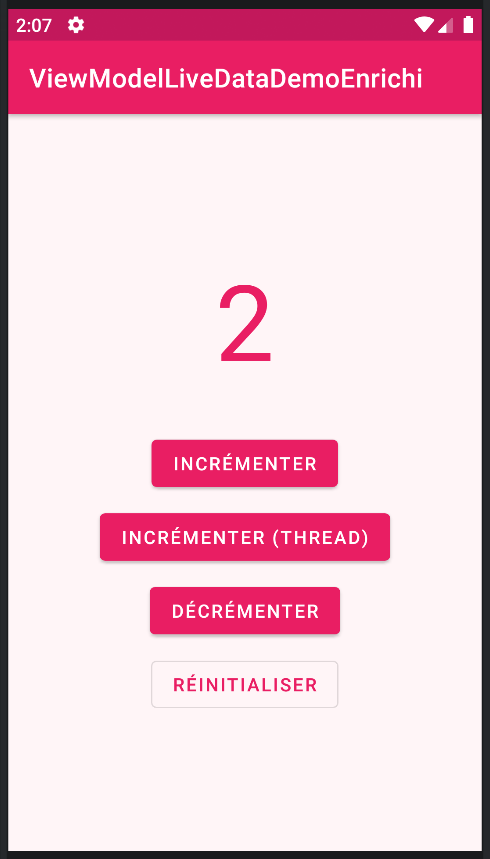

# LAB 18 - Architecture MVVM : ViewModel et LiveData
**Cours :** Programmation Mobile : Android avec Java  
**Étudiant :** Hajar Chaira

---

## 1. Objectif pédagogique
L'objectif de ce laboratoire est d'appréhender et d'implémenter l'architecture de conception **MVVM** (Model-View-ViewModel) recommandée par Google. Le projet résout le problème classique de la perte d'état lors des changements de configuration (rotation de l'écran ou changement de thème) en utilisant un composant **ViewModel** persistant en mémoire. L'interface graphique s'actualise de manière réactive et sécurisée grâce à un canal de données observable respectueux du cycle de vie (**LiveData**). De plus, des concepts avancés de multi-threading et de persistance contre les arrêts brutaux du système ont été intégrés.

---

## 2. Aperçu visuel de l'interface et Démonstration

### Capture d'écran de l'application finalisée

*Interface graphique premium de l'application personnalisée avec une charte graphique rose pastel. Elle présente l'affichage textuel du compteur synchronisé et l'ensemble des boutons de contrôle du système.*

---

## 3. Démonstration Vidéo
La vidéo ci-dessous présente la validation des fonctionnalités du projet : les incrémentations et décrémentations directes, le maintien rigoureux du compteur lors de multiples rotations d'écran, l'exécution asynchrone sécurisée initiée par le bouton de thread d'arrière-plan avec mise à jour différée, et la résilience du compteur face aux simulations de fermeture forcée.

<video src="img-lab18-dev/video.mp4" controls="controls" style="max-width: 100%;">
</video>

---

## 4. Architecture et Réalisation minimale

### Étape 1 : Configuration et Dépendances Jetpack
Création d'un projet Android autonome et intégration des dernières bibliothèques Jetpack Lifecycle au sein du gestionnaire de dépendances de l'application afin d'activer le support natif pour les objets ViewModel et LiveData.

### Étape 2 : Conception de l'Habillage Graphique et Colorimétrie
Définition d'une palette chromatique personnalisée à base de rose pastel et rose vif au sein des ressources système. L'agencement de l'écran principal regroupe de manière épurée la zone de texte du compteur et l'ensemble des boutons de déclenchement d'actions.

### Étape 3 : Développement du Modèle de Vue (CounterViewModel)
Conception du composant ViewModel qui encapsulate le compteur. Les données sont éditables à l'aide d'un canal modifiable (`MutableLiveData`) et exposées en lecture seule via un objet `LiveData` standard pour garantir la séparation des privilèges. Un état de sauvegarde persistent (`SavedStateHandle`) est adjoint au constructeur pour prémunir le compteur contre la destruction du processus par le système.

### Étape 4 : Intégration du Traitement Asynchrone (Bonus Thread)
Implémentation d'une méthode de calcul asynchrone au sein du ViewModel. Elle instancie un fil d'exécution d'arrière-plan (Background Thread) indépendant pour simuler un traitement lourd différé d'une seconde, puis communique les résultats vers le fil d'exécution graphique principal de manière sécurisée en employant l'asynchronisme de `postValue()`.

### Étape 5 : Câblage Réactif au sein de l'Activité principale
Liaison de l'activité au cycle de vie du ViewModel. L'activité s'abonne en tant qu'observateur passif sur le canal de données LiveData exposée. Elle met à jour automatiquement sa zone de texte dès qu'un changement de valeur survient et redirige les clics de ses boutons directement vers les méthodes d'action logique du ViewModel.

---

## 5. Compétences acquises
* **Découplage architectural (MVVM) :** Séparation stricte de la logique métier (ViewModel) et de la couche de rendu visuel (Activity).
* **Programmation réactive et asynchrone :** Manipulation sécurisée de flux de données asynchrones inter-threads via `postValue()` et observation respectueuse du cycle de vie avec `LiveData` pour éviter les fuites de mémoire.
* **Résilience d'état avancée :** Utilisation de `SavedStateHandle` pour assurer la persistance absolue des données face aux destructions de processus ordonnées par le système.

---
**Rapport de TP - 2026**
